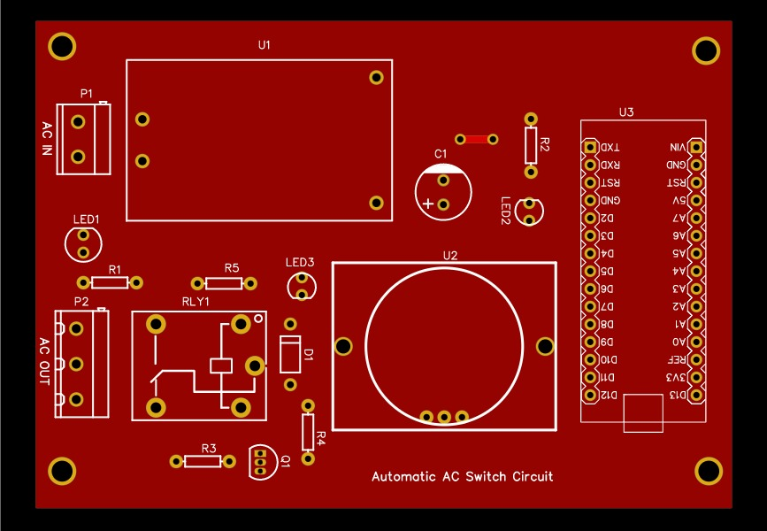

# Automatic AC Switch – PCB Design

## 📌 Overview
This project is a **PCB design for an Automatic AC Switch** using the EasyEDA tool. The system is designed to automatically control AC appliances based on motion detection. It integrates a **PIR sensor, Arduino Nano, and a relay driver circuit** with indicator LEDs.

The PCB includes an**AC-DC converter (HLK-5M05) for regulated power**, making the design compact and suitable for home automation projects.

## 🛠 Tools Used
- EasyEDA (schematic & PCB design)  

## 🔧 Features
- **Power Supply Unit (U1 – HLK-5M05)** : Converts AC input to +5V DC.
- **Arduino Nano (U3)**                : Central controller that processes the PIR sensor signal
- **PIR Sensor (U2 – HC-SR501)**        : Detects human motion and sends a signal to Arduino.
- **Relay Circuit (RLY1 + Q1 + D1)**    : Switches the AC load **ON/OFF** based on Arduino’s output.
- **Indicator LEDs (LED1, LED2, LED3)** : Provide power and status indication.
- **Resistors (R1–R5) & Capacitors (C1)**: Support biasing, protection, and signal conditioning.

## 📂 Repository Structure
- **schematic And BOM/** → schematic diagram (PDF) And BOM file.
- **pcb_layout/** → PCB layout images  
- **gerber_files/** → Fabrication-ready files for PCB manufacturing  
- **3D View/** → project 3D view images.  

## 🚀 🔧 Features

1. Automatic AC switching based on motion detection
2. Arduino Nano for flexible control
3. PIR sensor for human presence detection
4. Relay module for controlling AC loads
5. Indicator LEDs for power, PIR status, and relay status
6. Compact PCB design with onboard AC-DC power supply.  

## 📸 Project Images
## Top-Layout :

## bottom-Layout :

## Top-3D-View :

## bottom-3D-View :

## 📄 License
This project is shared for educational and learning purposes.
